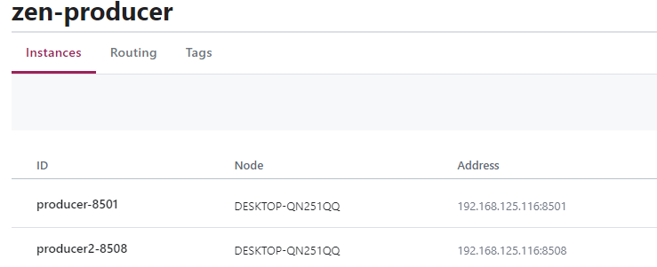
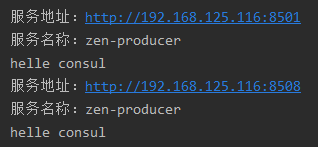
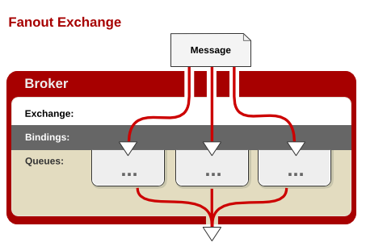
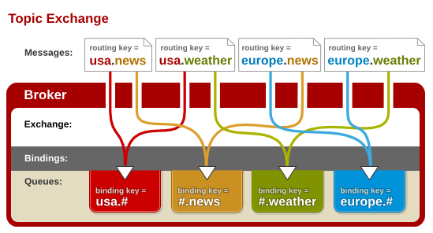
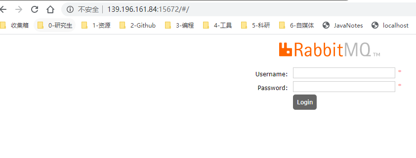
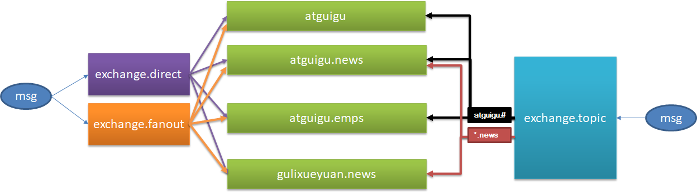
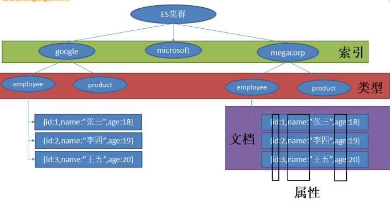

# Consul

## Consul介绍

Eureka 2.0 的开源工作已经停止，依赖于开源库里面的 Eureka 2.x 分支构建的项目或者相关代码，风险自负。

Spring Cloud 中 Consul 使用也较为广泛，Consul 是一套开源的分布式服务发现和配置管理系统，由 HashiCorp 公司用 Go 语言开发。它具有很多优点。包括： 基于 raft 协议，比较简洁； 支持健康检查, 同时支持 HTTP 和 DNS 协议 支持跨数据中心的 WAN 集群 提供图形界面 跨平台，支持 Linux、Mac、Windows。

| eature               | euerka                       | Consul                 | zookeeper             | etcd              |
| :------------------- | :--------------------------- | :--------------------- | :-------------------- | :---------------- |
| 服务健康检查         | 可配支持                     | 服务状态，内存，硬盘等 | (弱)长连接，keepalive | 连接心跳          |
| 多数据中心           | —                            | 支持                   | —                     | —                 |
| kv 存储服务          | —                            | 支持                   | 支持                  | 支持              |
| 一致性               | —                            | raft                   | paxos                 | raft              |
| cap                  | ap                           | cp                     | cp                    | cp                |
| 使用接口(多语言能力) | http（sidecar）              | 支持 http 和 dns       | 客户端                | http/grpc         |
| watch 支持           | 支持 long polling/大部分增量 | 全量/支持long polling  | 支持                  | 支持 long polling |
| 自身监控             | metrics                      | metrics                | —                     | metrics           |
| 安全                 | —                            | acl /https             | acl                   | https 支持（弱）  |
| spring cloud 集成    | 已支持                       | 已支持                 | 已支持                | 已支持            |

**Consul 的优势：**

- 使用 Raft 算法来保证一致性, 比复杂的 Paxos 算法更直接. 相比较而言, zookeeper 采用的是 Paxos, 而 etcd 使用的则是 Raft。
- 支持多数据中心，内外网的服务采用不同的端口进行监听。 多数据中心集群可以避免单数据中心的单点故障,而其部署则需要考虑网络延迟, 分片等情况等。 zookeeper 和 etcd 均不提供多数据中心功能的支持。
- 支持健康检查。 etcd 不提供此功能。
- 支持 http 和 dns 协议接口。 zookeeper 的集成较为复杂, etcd 只支持 http 协议。
- 官方提供 web 管理界面, etcd 无此功能。
- 综合比较, Consul 作为服务注册和配置管理的新星, 比较值得关注和研究。

**特性：**

- 服务发现
- 健康检查
- Key/Value 存储
- 多数据中心

**Consul 角色**

- client: 客户端, 无状态, 将 HTTP 和 DNS 接口请求转发给局域网内的服务端集群。
- server: 服务端, 保存配置信息, 高可用集群, 在局域网内与本地客户端通讯, 通过广域网与其它数据中心通讯。 每个数据中心的 server 数量推荐为 3 个或是 5 个。

**Consul 工作原理：**


- 1、当 Producer 启动的时候，会向 Consul 发送一个 post 请求，告诉 Consul 自己的 IP 和 Port
- 2、Consul 接收到 Producer 的注册后，每隔10s（默认）会向 Producer 发送一个健康检查的请求，检验Producer是否健康
- 3、当 Consumer 发送 GET 方式请求 /api/address 到 Producer 时，会先从 Consul 中拿到一个存储服务 IP 和 Port 的临时表，从表中拿到 Producer 的 IP 和 Port 后再发送 GET 方式请求 /api/address
- 4、该临时表每隔10s会更新，只包含有通过了健康检查的 Producer

Spring Cloud Consul 项目是针对 Consul 的服务治理实现。Consul 是一个分布式高可用的系统，它包含多个组件，但是作为一个整体，在微服务架构中为我们的基础设施提供服务发现和服务配置的工具。

## Consul 安装

windows 下载exe文件

run.bat的内容：

```
consul agent -dev
pause
```

通过脚本运行，访问地址为：http://localhost:8500


## 引入依赖

- `spring-boot-starter-actuator` 健康检查依赖于此包。
- `spring-cloud-starter-consul-discovery` Spring Cloud Consul 的支持

```xml
<parent>
        <groupId>org.springframework.boot</groupId>
        <artifactId>spring-boot-starter-parent</artifactId>
        <version>2.0.3.RELEASE</version>
        <relativePath/> <!-- lookup parent from repository -->
    </parent>

    <properties>
        <project.build.sourceEncoding>UTF-8</project.build.sourceEncoding>
        <project.reporting.outputEncoding>UTF-8</project.reporting.outputEncoding>
        <java.version>1.8</java.version>
        <spring-cloud.version>Finchley.RELEASE</spring-cloud.version>
    </properties>

    <dependencies>
        <dependency>
            <groupId>org.springframework.boot</groupId>
            <artifactId>spring-boot-starter-actuator</artifactId>
        </dependency>
        <dependency>
            <groupId>org.springframework.cloud</groupId>
            <artifactId>spring-cloud-starter-consul-discovery</artifactId>
        </dependency>
        <dependency>
            <groupId>org.springframework.boot</groupId>
            <artifactId>spring-boot-starter-web</artifactId>
        </dependency>
        <dependency>
            <groupId>org.springframework.boot</groupId>
            <artifactId>spring-boot-starter-test</artifactId>
            <scope>test</scope>
        </dependency>
    </dependencies>

    <dependencyManagement>
        <dependencies>
            <dependency>
                <groupId>org.springframework.cloud</groupId>
                <artifactId>spring-cloud-dependencies</artifactId>
                <version>${spring-cloud.version}</version>
                <type>pom</type>
                <scope>import</scope>
            </dependency>
        </dependencies>
    </dependencyManagement>

```


## 编写服务提供者

1、主程序加上@EnableDiscoveryClient注解

2、配置

```properties
spring.application.name=producer
server.port=8501
spring.cloud.consul.host=localhost
spring.cloud.consul.port=8500
#注册到consul的服务名称
spring.cloud.consul.discovery.serviceName=zen-producer

```


3.再复制一份producer代码，修改端口



## 编写服务消费者

1、配置

```properties
spring.application.name=consumer
server.port=8503
spring.cloud.consul.host=127.0.0.1
spring.cloud.consul.port=8500
#设置不需要注册到consul中
spring.cloud.consul.discovery.register=false

```

2、调用

```java
@RestController
public class CallHelloController {

    @Autowired
    private LoadBalancerClient loadBalancer;

    @RequestMapping("/call")
    public String call() {
        ServiceInstance serviceInstance = loadBalancer.choose("zen-producer");
        System.out.println("服务地址：" + serviceInstance.getUri());
        System.out.println("服务名称：" + serviceInstance.getServiceId());

        String callServiceResult =
            new RestTemplate().getForObject(serviceInstance.getUri().toString() + "/hello", String.class);
        System.out.println(callServiceResult);
        return callServiceResult;
    }

}
```




## 使用Feign调用

1、引入依赖

```xml
 		<dependency>
            <groupId>org.springframework.cloud</groupId>
            <artifactId>spring-cloud-starter-feign</artifactId>
        </dependency>
```

2、启动类加上`@EnableDiscoveryClient`和`@EnableFeignClients`

- `@EnableDiscoveryClient` 启用服务注册与发现
- `@EnableFeignClients` 启用feign进行远程调用

3、编写Feign服务接口

```java
@FeignClient(name= "zen-producer")
public interface HelloClient {
    @RequestMapping(value = "/hello")
    public String call();
}

```

4、调用

```java
@RestController
public class HelloController {

    @Autowired
    private HelloClient helloClient;
    
    @RequestMapping("/feignhello")
    public String hello() {
        return helloClient.call();
    }
}

```


# SpringBoot与SpringCloud的版本对应

版本对应关系
大版本对应：

| Spring Cloud             | Spring Boot                                    |
| ------------------------ | ---------------------------------------------- |
| Angel版本                | 兼容Spring Boot 1.2.x                          |
| Brixton版本              | 兼容Spring Boot 1.3.x，也兼容Spring Boot 1.4.x |
| Camden版本               | 兼容Spring Boot 1.4.x，也兼容Spring Boot 1.5.x |
| Dalston版本、Edgware版本 | 兼容Spring Boot 1.5.x，不兼容Spring Boot 2.0.x |
| Finchley版本             | 兼容Spring Boot 2.0.x，不兼容Spring Boot 1.5.x |
| Greenwich版本            | 兼容Spring Boot 2.1.x                          |

在实际开发过程中，我们需要更详细的版本对应：

| Spring Cloud  | Spring Boot                                    |
| ------------- | ---------------------------------------------- |
| 1.5.2.RELEASE | Dalston.RC1                                    |
| 1.5.9.RELEASE | Edgware.RELEASE                                |
| 2.0.2.RELEASE | Finchley.BUILD-SNAPSHOT                        |
| 2.0.3.RELEASE | Finchley.RELEASE                               |


# 消息队列MQ

## 概述

**1.大多应用中，可通过消息服务中间件来提升系统异步通信、扩展解耦能力**

**2.消息服务中两个重要概念：**

​    消息代理（message broker）和目的地（destination）

当消息发送者发送消息以后，将由消息代理接管，消息代理保证消息传递到指定目的地。

**3.消息队列主要有两种形式的目的地**

​	1**.队列（queue）**：点对点消息通信（point-to-point）

​	2.**主题（topic）**：发布（publish）/订阅（subscribe）消息通信

**4.点对点式：**

- 消息发送者发送消息，消息代理将其放入一个队列中，消息接收者从队列中获取消息内容，消息读取后被移出队列

- 消息只有唯一的发送者和接受者，但并不是说只能有一个接收者

**5.发布订阅式：**

- 发送者（发布者）发送消息到主题，多个接收者（订阅者）监听（订阅）这个主题，那么就会在消息到达时同时收到消息

6.**JMS（Java Message Service）JAVA消息服务**：

- 基于JVM消息代理的规范。ActiveMQ、HornetMQ是JMS实现

7.**AMQP（Advanced Message Queuing Protocol）**

- 高级消息队列协议，也是一个消息代理的规范，兼容JMS

- RabbitMQ是AMQP的实现

|              | JMS                                                          | AMQP                                                         |
| ------------ | ------------------------------------------------------------ | ------------------------------------------------------------ |
| 定义         | Java  api                                                    | 网络线级协议                                                 |
| 跨语言       | 否                                                           | 是                                                           |
| 跨平台       | 否                                                           | 是                                                           |
| Model        | 提供两种消息模型：  （1）、Peer-2-Peer  （2）、Pub/sub       | 提供了五种消息模型：  （1）direct  exchange  （2）fanout  exchange  （3）topic  change  （4）headers  exchange  （5）system  exchange  本质来讲，后四种和JMS的pub/sub模型没有太大差别，仅是在路由机制上做了更详细的划分； |
| 支持消息类型 | 多种消息类型：  TextMessage  MapMessage  BytesMessage  StreamMessage  ObjectMessage  Message  （只有消息头和属性） | byte[]  当实际应用时，有复杂的消息，可以将消息序列化后发送。 |
| 综合评价     | JMS  定义了JAVA  API层面的标准；在java体系中，多个client均可以通过JMS进行交互，不需要应用修改代码，但是其对跨平台的支持较差； | AMQP定义了wire-level层的协议标准；天然具有跨平台、跨语言特性。 |

**8.Spring支持**

- spring-jms提供了对JMS的支持

- spring-rabbit提供了对AMQP的支持

- 需要ConnectionFactory的实现来连接消息代理

- 提供JmsTemplate、RabbitTemplate来发送消息

- @JmsListener（JMS）、@RabbitListener（AMQP）注解在方法上监听消息代理发布的消息
  @EnableJms、@EnableRabbit开启支持

**9.Spring Boot自动配置**

  - JmsAutoConfiguration
  - RabbitAutoConfiguration

## RabbitMQ简介

RabbitMQ简介：RabbitMQ是一个由erlang开发的AMQP(Advanved Message Queue Protocol)的开源实现。


### 核心概念

- **Message**
  消息，消息是不具名的，它由消息头和消息体组成。消息体是不透明的，而消息头则由一系列的可选属性组成，这些属性包括routing-key（路由键）、priority（相对于其他消息的优先权）、delivery-mode（指出该消息可能需要持久性存储）等。

- **Publisher**
  消息的生产者，也是一个向交换器发布消息的客户端应用程序。

- **Exchange**
  交换器，用来接收生产者发送的消息并将这些消息路由给服务器中的队列。
  Exchange有4种类型：**direct(默认)，fanout, topic, 和headers**，不同类型的Exchange转发消息的策略有所区别

- **Queue**
  消息队列，用来保存消息直到发送给消费者。它是消息的容器，也是消息的终点。一个消息可投入一个或多个队列。消息一直在队列里面，等待消费者连接到这个队列将其取走。

- **Binding**
  绑定，用于消息队列和交换器之间的关联。一个绑定就是基于路由键将交换器和消息队列连接起来的路由规则，所以可以将交换器理解成一个由绑定构成的路由表。
  Exchange 和Queue的绑定可以是多对多的关系。

- **Connection**
  网络连接，比如一个TCP连接。

- **Channel**
  信道，多路复用连接中的一条独立的双向数据流通道。信道是建立在真实的TCP连接内的虚拟连接，AMQP 命令都是通过信道发出去的，不管是发布消息、订阅队列还是接收消息，这些动作都是通过信道完成。因为对于操作系统来说建立和销毁 TCP 都是非常昂贵的开销，所以引入了信道的概念，以复用一条 TCP 连接。

- **Consumer**
  消息的消费者，表示一个从消息队列中取得消息的客户端应用程序。

- **Virtual Host**
  虚拟主机，表示一批交换器、消息队列和相关对象。虚拟主机是共享相同的身份认证和加密环境的独立服务器域。每个 vhost 本质上就是一个 mini 版的 RabbitMQ 服务器，拥有自己的队列、交换器、绑定和权限机制。vhost 是 AMQP 概念的基础，必须在连接时指定，RabbitMQ 默认的 vhost 是 / （通过路径划分）。

- **Broker**
  表示消息队列服务器实体


### 运行机制

AMQP 中的消息路由：AMQP 中消息的路由过程和 Java 开发者熟悉的 JMS 存在一些差别，AMQP 中增加了 Exchange 和 Binding 的角色。生产者把消息发布到 Exchange 上，消息最终到达队列并被消费者接收，而 Binding 决定交换器的消息应该发送到那个队列。


#### Exchange 类型

Exchange分发消息时根据类型的不同分发策略有区别，目前共四种类型：**direct**、**fanout**、**topic**、**headers** 。headers 匹配 AMQP 消息的 header 而不是路由键， headers 交换器和 direct 交换器完全一致，但性能差很多，目前几乎用不到了，所以直接看另外三种类型：

#####  direct 交换器


消息中的路由键（routing key）如果和 Binding 中的 binding key 一致， 交换器就将消息发到对应的队列中。路由键与队列名完全匹配，如果一个队列绑定到交换机要求路由键为“dog”，则只转发 routing key 标记为“dog”的消息，不会转发“dog.puppy”，也不会转发“dog.guard”等等。**它是完全匹配、单播的模式。**

##### fanout 交换器



每个发到 fanout 类型交换器的消息都会分到所有绑定的队列上去。**fanout 交换器不处理路由键**，只是简单的将队列绑定到交换器上，每个发送到交换器的消息都会被转发到与该交换器绑定的所有队列上。很像子网广播，每台子网内的主机都获得了一份复制的消息。fanout 类型转发消息是最快的。

##### topic交换器



topic 交换器通过模式匹配分配消息的路由键属性，将路由键和某个模式进行匹配，此时队列需要绑定到一个模式上。它将路由键和绑定键的字符串切分成单词，这些单词之间用点隔开。它同样也会识别两个通配符：符号 # 和符号 * 。# 匹配 0 个或多个单词，* 匹配一个单词。


### 安装使用

1.docker安装rabbitmq

2.默认登录页面 用户名和密码为 guest



3.测试



添加exchange和queue，并进行binding

测试**direct**、**fanout**、**topic**三种exchange消息发生方式


### 测试程序

#### 自动配置

 *  1、RabbitAutoConfiguration
 *  2、有自动配置了连接工厂ConnectionFactory；
 *  3、RabbitProperties 封装了 RabbitMQ的配置
 *  4、 RabbitTemplate ：给RabbitMQ发送和接受消息；
 *  5、 AmqpAdmin ： RabbitMQ系统管理功能组件;创建和删除 Queue，Exchange，Binding
 *  6、@EnableRabbit +  @RabbitListener 监听消息队列的内容


#### 编写测试程序

```java
/**
	 * 1、单播（点对点）
	 */
	@Test
	public void publish() {

		//对象被默认的JDK序列化以后发送出去，
		// 如何将数据自动的转为json发送出去：配置Jackson2JsonMessageConverter
		rabbitTemplate.convertAndSend("exchange.direct","antguigu.news",new Book("西游记","吴承恩"));

	}

	//接受数据,
	@Test
	public void receive(){
		Object o = rabbitTemplate.receiveAndConvert("antguigu.news");
		System.out.println(o.getClass());
		System.out.println(o);
	}

	/**
	 * 广播
	 */
	@Test
	public void sendMsg(){
		rabbitTemplate.convertAndSend("exchange.fanout","",new Book("红楼梦","曹雪芹"));
	}

```

#### 监听

使用 @RabbitListener，同时要在主程序加上@EnableRabbit 

```java
@Service
public class BookService {

    @RabbitListener(queues = "antguigu.news")
    public void receive(Map map){
        System.out.println("收到消息："+map);
    }

    @RabbitListener(queues = "atguigu")
    public void receive02(Message message){
        System.out.println(message.getBody());
        System.out.println(message.getMessageProperties());
    }
}
```

#### AmqpAdmin 

创建和删除 Queue，Exchange，Binding

```java
	@Autowired
	AmqpAdmin amqpAdmin;

	@Test
	public void createExchange(){

		amqpAdmin.declareExchange(new DirectExchange("amqpadmin.exchange"));
		

		amqpAdmin.declareQueue(new Queue("amqpadmin.queue",true));
	
		
		amqpAdmin.declareBinding(new Binding("amqpadmin.queue", Binding.DestinationType.QUEUE,"amqpadmin.exchange","amqp.haha",null));

        amqpAdmin.deleteExchange("amqpadmin.exchange");
	
	}
```

---


# ES

## 简介

我们的应用经常需要添加检索功能，开源的 [ElasticSearch](https://www.elastic.co/) 是目前全文搜索引擎的首选。他可以快速的存储、搜索和分析海量数据。Spring Boot通过整合Spring Data ElasticSearch为我们提供了非常便捷的检索功能支持；

Elasticsearch是一个分布式搜索服务，提供Restful API，底层基于Lucene，采用多shard（分片）的方式保证数据安全，并且提供自动resharding的功能，github等大型的站点也是采用了ElasticSearch作为其搜索服务，

以 ***员工文档*** 的形式存储为例：一个文档代表一个员工数据。存储数据到 ElasticSearch 的行为叫做 ***索引*** ，但在索引一个文档之前，需要确定将文档存储在哪里。

一个 ElasticSearch 集群可以 包含多个 ***索引*** ，相应的每个索引可以包含多个 ***类型*** 。 这些不同的类型存储着多个 ***文档*** ，每个文档又有 多个 ***属性*** 。

类似关系：

- 索引-数据库

- 类型-表

- 文档-表中的记录

- 属性-列



ES简体中文文档：https://www.elastic.co/guide/cn/elasticsearch/guide/current/index.html


## 操作

对于员工目录，我们将做如下操作：

- 每个员工索引一个文档，文档包含该员工的所有信息。
- 每个文档都将是 `employee` *类型* 。
- 该类型位于 *索引* `megacorp` 内。
- 该索引保存在我们的 Elasticsearch 集群中。

```
PUT /megacorp/employee/1

{
    "first_name" : "John",
    "last_name" :  "Smith",
    "age" :        25,
    "about" :      "I love to go rock climbing",
    "interests": [ "sports", "music" ]
}
```

```sense
GET /megacorp/employee/1
```

暂略


## 程序

SpringBoot默认支持两种技术来和ES交互；

* ### Jest（默认不生效）

  需要导入jest的工具包（io.searchbox.client.JestClient）

```xml
		<dependency>
			<groupId>io.searchbox</groupId>
			<artifactId>jest</artifactId>
			<version>5.3.3</version>
		</dependency>
```

配置

```properties
spring.elasticsearch.jest.uris=http://118.24.44.169:9200
```

```java
	@Autowired
	JestClient jestClient;

	@Test
	public void contextLoads() {
		//1、给Es中索引（保存）一个文档；
		Article article = new Article();
		article.setId(1);
		article.setTitle("好消息");
		article.setAuthor("zhangsan");
		article.setContent("Hello World");

		//构建一个索引功能
		Index index = new Index.Builder(article).index("atguigu").type("news").build();

		try {
			//执行
			jestClient.execute(index);
		} catch (IOException e) {
			e.printStackTrace();
		}
	}

	//测试搜索
	@Test
	public void search(){

		//查询表达式
		String json ="{\n" +
				"    \"query\" : {\n" +
				"        \"match\" : {\n" +
				"            \"content\" : \"hello\"\n" +
				"        }\n" +
				"    }\n" +
				"}";

		//更多操作：https://github.com/searchbox-io/Jest/tree/master/jest
		//构建搜索功能
		Search search = new Search.Builder(json).addIndex("atguigu").addType("news").build();

		//执行
		try {
			SearchResult result = jestClient.execute(search);
			System.out.println(result.getJsonString());
		} catch (IOException e) {
			e.printStackTrace();
		}
	}

}

```


* ### SpringData ElasticSearch【ES版本有可能不合适】

  版本适配说明：https://github.com/spring-projects/spring-data-elasticsearch

  如果版本不适配：2.4.6

  *        1）、升级SpringBoot版本
  *        2）、安装对应版本的ES


  1）、Client 节点信息clusterNodes；clusterName

  2）、ElasticsearchTemplate 操作es

  3）、编写一个 ElasticsearchRepository 的子接口来操作ES；


引入依赖

```xml
		<!--SpringBoot默认使用SpringData ElasticSearch模块进行操作-->
		<dependency>
			<groupId>org.springframework.boot</groupId>
			<artifactId>spring-boot-starter-data-elasticsearch</artifactId>
		</dependency>
```

配置

```properties
spring.data.elasticsearch.cluster-name=elasticsearch
spring.data.elasticsearch.cluster-nodes=118.24.44.169:9301
```


* 编写一个 ElasticsearchRepository

   //参照 https://docs.spring.io/spring-data/elasticsearch/docs/3.0.6.RELEASE/reference/html/

```java
public interface BookRepository extends ElasticsearchRepository<Book,Integer> {

   
   public List<Book> findByBookNameLike(String bookName);

}

```

```java
@Document(indexName = "atguigu",type = "book")
public class Book {
    private Integer id;
    private String bookName;
    private String author;
```

```java
	public void test02(){
		Book book = new Book();
		book.setId(1);
		book.setBookName("西游记");
		book.setAuthor("吴承恩");
		bookRepository.index(book);


		for (Book book : bookRepository.findByBookNameLike("游")) {
			System.out.println(book);
		}
		;

	}

```

