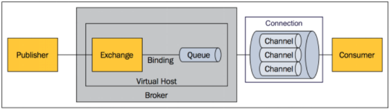
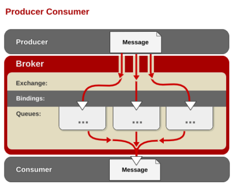
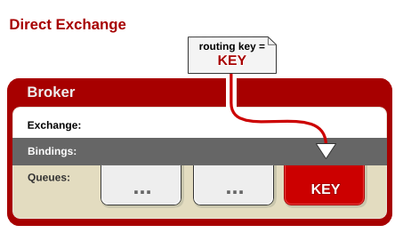

一、SpringBoot与缓存

## JSR107

Java Caching定义了5个核心接口，分别是CachingProvider, CacheManager, Cache, Entry 和 Expiry。

- CachingProvider定义了创建、配置、获取、管理和控制多个CacheManager。一个应用可以在运行期访问多个CachingProvider。
- CacheManager定义了创建、配置、获取、管理和控制多个唯一命名的Cache，这些Cache存在于CacheManager的上下文中。一个CacheManager仅被一个CachingProvider所拥有。
- Cache是一个类似Map的数据结构并临时存储以Key为索引的值。一个Cache仅被一个CacheManager所拥有。
- Entry是一个存储在Cache中的key-value对。
- Expiry 每一个存储在Cache中的条目有一个定义的有效期。一旦超过这个时间，条目为过期的状态。一旦过期，条目将不可访问、更新和删除。缓存有效期可以通过ExpiryPolicy设置。


## Spring缓存抽象

Spring从3.1开始定义了org.springframework.cache.Cache和org.springframework.cache.CacheManager接口来统一不同的缓存技术；并支持使用JCache（JSR-107）注解简化我们开发；


- Cache接口为缓存的组件规范定义，包含缓存的各种操作集合；
- Cache接口下Spring提供了各种xxxCache的实现；如RedisCache，EhCacheCache , ConcurrentMapCache等；
- 每次调用需要缓存功能的方法时，Spring会检查检查指定参数的指定的目标方法是否已经被调用过；如果有就直接从缓存中获取方法调用后的结果，如果没有就调用方法并缓存结果后返回给用户。下次调用直接从缓存中获取。
- 使用Spring缓存抽象时我们需要关注以下两点：
  - 确定方法需要被缓存以及他们的缓存策略
  - 从缓存中读取之前缓存存储的数据

## 几个重要概念和注解

| **Cache**          | 缓存接口，定义缓存操作。实现有：RedisCache、EhCacheCache、ConcurrentMapCache等 |
| ------------------ | ------------------------------------------------------------ |
| **CacheManager**   | **缓存管理器，管理各种缓存（Cache）组件**                    |
| **@Cacheable**     | **主要针对方法配置，能够根据方法的请求参数对其结果进行缓存** |
| **@CacheEvict**    | **清空缓存**                                                 |
| **@CachePut**      | **保证方法被调用，又希望结果被缓存。**                       |
| **@EnableCaching** | **开启基于注解的缓存**                                       |
| **keyGenerator**   | **缓存数据时key生成策略**                                    |
| **serialize**      | **缓存数据时value序列化策略**                                |

---

## Cacheable原理

将方法的运行结果进行缓存；以后再要相同的数据，直接从缓存中获取，不用调用方法；

CacheManager管理多个Cache组件的，对缓存的真正CRUD操作在Cache组件中，每一个缓存组件有自己唯一的名字；

```java
  @Cacheable(value = {"emp"}/*,keyGenerator = "myKeyGenerator",condition = "#a0>1",unless = "#a0==2"*/)
    public Employee getEmp(Integer id){
        System.out.println("查询"+id+"号员工");
        Employee emp = employeeMapper.getEmpById(id);
        return emp;
    }
```

几个属性：
* cacheNames/value：指定缓存组件的名字;将方法的返回结果放在哪个缓存中，是数组的方式，可以指定多个缓存；

* key：缓存数据使用的key；可以用它来指定。默认是使用方法参数的值；编写SpEL

* keyGenerator：key的生成器，可以自己指定key的生成器的组件id；key/keyGenerator：二选一使用;

* cacheManager：指定缓存管理器；或者cacheResolver指定获取解析器

* condition：指定符合条件的情况下才缓存；`condition = "#id>0"`

* unless：当unless指定的条件为true，方法的返回值就不会被缓存；可以获取到结果进行判断

  `unless = "#result == null"`

* sync：是否使用异步模式

**Cache SpEL available metadata**

| **名字**        | **位置**           | **描述**                                                     | **示例**             |
| --------------- | ------------------ | ------------------------------------------------------------ | -------------------- |
| methodName      | root object        | 当前被调用的方法名                                           | #root.methodName     |
| method          | root object        | 当前被调用的方法                                             | #root.method.name    |
| target          | root object        | 当前被调用的目标对象                                         | #root.target         |
| targetClass     | root object        | 当前被调用的目标对象类                                       | #root.targetClass    |
| args            | root object        | 当前被调用的方法的参数列表                                   | #root.args[0]        |
| caches          | root object        | 当前方法调用使用的缓存列表（如@Cacheable(value={"cache1", "cache2"})），则有两个cache | #root.caches[0].name |
| *argument name* | evaluation context | 方法参数的名字. 可以直接 #参数名 ，也可以使用 #p0或#a0 的形式，0代表参数的索引； | #iban 、 #a0 、 #p0  |
| result          | evaluation context | 方法执行后的返回值（仅当方法执行之后的判断有效，如‘unless’，’cache put’的表达式 ’cache evict’的表达式beforeInvocation=false） | #result              |


### **缓存原理**

1、自动配置类：CacheAutoConfiguration

2、缓存的配置类

* org.springframework.boot.autoconfigure.cache.GenericCacheConfiguration

* org.springframework.boot.autoconfigure.cache.JCacheCacheConfiguration

* org.springframework.boot.autoconfigure.cache.EhCacheCacheConfiguration

* org.springframework.boot.autoconfigure.cache.HazelcastCacheConfiguration

* org.springframework.boot.autoconfigure.cache.InfinispanCacheConfiguration

* org.springframework.boot.autoconfigure.cache.CouchbaseCacheConfiguration

* org.springframework.boot.autoconfigure.cache.RedisCacheConfiguration

* org.springframework.boot.autoconfigure.cache.CaffeineCacheConfiguration

* org.springframework.boot.autoconfigure.cache.GuavaCacheConfiguration

* org.springframework.boot.autoconfigure.cache.SimpleCacheConfiguration【默认】

* org.springframework.boot.autoconfigure.cache.NoOpCacheConfiguration

3、哪个配置类默认生效：SimpleCacheConfiguration；

4、给容器中注册了一个CacheManager：ConcurrentMapCacheManager

5、可以获取和创建 ConcurrentMapCache 类型的缓存组件；他的作用将数据保存在 ConcurrentMap 中；


### **运行流程：**`@Cacheable`

1、方法运行之前，先去查询Cache（缓存组件），按照cacheNames指定的名字获取；

（CacheManager先获取相应的缓存），第一次获取缓存如果没有Cache组件会自动创建。

2、去Cache中查找缓存的内容，使用一个key，默认就是方法的参数；

* key是按照某种策略生成的；默认是使用 keyGenerator 生成的，默认使用 SimpleKeyGenerator 生成key；

  SimpleKeyGenerator 生成key 的默认策略：

  * 如果没有参数；key=new SimpleKey()；

  * 如果有一个参数：key=参数的值

  * 如果有多个参数：key=new SimpleKey(params)；


3、没有查到缓存就调用目标方法；

4、将目标方法返回的结果，放进缓存中


`@Cacheable`标注的方法执行之前先来检查缓存中有没有这个数据，默认按照参数的值作为key去查询缓存，

如果没有就运行方法并将结果放入缓存；以后再来调用就可以直接使用缓存中的数据；


核心：

- 使用 CacheManager【ConcurrentMapCacheManager】按照名字得到 Cache【ConcurrentMapCache】组件
- key使用 keyGenerator 生成的，默认是 SimpleKeyGenerator


### @CachePut

1. 既调用方法，又更新缓存数据；同步更新缓存
2. 修改了数据库的某个数据，同时更新缓存；

**运行时机**：

 * 1、先调用目标方法

 *  2、将目标方法的结果缓存起来

 

```java
/**
 *
 * 测试步骤：
 *  1、查询1号员工；查到的结果会放在缓存中；
 *          key：1  value：lastName：张三
 *  2、以后查询还是之前的结果
 *  3、更新1号员工；【lastName:zhangsan；gender:0】
 *          将方法的返回值也放进缓存了；
 *          key：传入的employee对象  值：返回的employee对象；
 *  4、查询1号员工？
 *      应该是更新后的员工；
 *          key = "#employee.id":使用传入的参数的员工id；
 *          key = "#result.id"：使用返回后的id | @Cacheable的key是不能用#result
 *      为什么是没更新前的？【1号员工没有在缓存中更新】
 *
 */
@CachePut(/*value = "emp",*/key = "#result.id")
public Employee updateEmp(Employee employee){
    System.out.println("updateEmp:"+employee);
    employeeMapper.updateEmp(employee);
    return employee;
}
```


### @CacheEvict  key：指定要清除的数据

*  allEntries = true：指定清除这个缓存中所有的数据
* beforeInvocation = false：缓存的清除是否在方法之前执行

  默认代表缓存清除操作是在方法执行之后执行;如果出现异常缓存就不会清除
* beforeInvocation = true：

  代表清除缓存操作是在方法运行之前执行，无论方法是否出现异常，缓存都清除


### @Caching

```java
    @Caching(
         cacheable = {
             @Cacheable(/*value="emp",*/key = "#lastName")
         },
         put = {
             @CachePut(/*value="emp",*/key = "#result.id"),
             @CachePut(/*value="emp",*/key = "#result.email")
         }
    )
    public Employee getEmpByLastName(String lastName){
        return employeeMapper.getEmpByLastName(lastName);
    }

```


### @CacheConfig

```java
@CacheConfig(cacheNames="emp"/*,cacheManager = "employeeCacheManager"*/) //抽取缓存的公共配置
```


## Redis整合

1.引入依赖
```xml
		<dependency>
			<groupId>org.springframework.boot</groupId>
			<artifactId>spring-boot-starter-data-redis</artifactId>
		</dependency>
```

2.配置文件 application.properties

```properties
spring.redis.host=XX
```

3.测试类

```java
	@Autowired
	StringRedisTemplate stringRedisTemplate;  //操作k-v都是字符串的

	@Autowired
	RedisTemplate redisTemplate;  //k-v都是对象的
	/**
	 * Redis常见的五大数据类型
	 *  String（字符串）、List（列表）、Set（集合）、Hash（散列）、ZSet（有序集合）
	 *  stringRedisTemplate.opsForValue()[String（字符串）]
	 *  stringRedisTemplate.opsForList()[List（列表）]
	 *  stringRedisTemplate.opsForSet()[Set（集合）]
	 *  stringRedisTemplate.opsForHash()[Hash（散列）]
	 *  stringRedisTemplate.opsForZSet()[ZSet（有序集合）]
	 */
	@Test
	public void test01(){
		//给redis中保存数据
	    stringRedisTemplate.opsForValue().append("msg","hello");
		String msg = stringRedisTemplate.opsForValue().get("msg");
		System.out.println(msg);

		stringRedisTemplate.opsForList().leftPush("mylist","1");
		stringRedisTemplate.opsForList().leftPush("mylist","2");
	}

	//测试保存对象
	@Test
	public void test02(){
		Employee empById = employeeMapper.getEmpById(1);
		//默认如果保存对象，使用jdk序列化机制，序列化后的数据保存到redis中
		redisTemplate.opsForValue().set("emp-01",empById);
		//1、将数据以json的方式保存
		 //(1)自己将对象转为json
		 //(2)redisTemplate默认的序列化规则；改变默认的序列化规则；
		empRedisTemplate.opsForValue().set("emp-01",empById);
	}
```

4.配置Redis

```java
@Configuration
public class MyRedisConfig {

    //自定义序列化器
    @Bean
    public RedisTemplate<Object, Employee> empRedisTemplate(RedisConnectionFactory redisConnectionFactory) throws UnknownHostException {
        
        RedisTemplate<Object, Employee> template = new RedisTemplate<Object, Employee>();        
        template.setConnectionFactory(redisConnectionFactory);
        
        Jackson2JsonRedisSerializer<Employee> ser = new Jackson2JsonRedisSerializer<Employee>(Employee.class);
       
        template.setDefaultSerializer(ser);
        
        return template;
        
    }


    //CacheManagerCustomizers可以来定制缓存的一些规则
    @Primary  //将某个缓存管理器作为默认的
    @Bean
    public RedisCacheManager employeeCacheManager(RedisTemplate<Object, Employee> empRedisTemplate){
        RedisCacheManager cacheManager = new RedisCacheManager(empRedisTemplate);
        //key多了一个前缀

        //使用前缀，默认会将CacheName作为key的前缀
        cacheManager.setUsePrefix(true);

        return cacheManager;
    }

}
```


测试缓存：

原理：CacheManager===Cache 缓存组件来实际给缓存中存取数据

1）、引入redis的starter，容器中保存的是 RedisCacheManager；

2）、RedisCacheManager 帮我们创建 RedisCache 来作为缓存组件；RedisCache通过操作redis缓存数据的

3）、默认保存数据 k-v 都是Object；利用序列化保存；如何保存为json
- 1、引入了redis的starter，cacheManager变为 RedisCacheManager；
- 2、默认创建的 RedisCacheManager 操作redis的时候使用的是 RedisTemplate<Object, Object>
- 3、RedisTemplate<Object, Object> 是 默认使用jdk的序列化机制

4）、自定义CacheManager；


```java
    @Qualifier("deptCacheManager")
    @Autowired
    RedisCacheManager deptCacheManager;


    /**
     *  缓存的数据能存入redis；
     *  第二次从缓存中查询就不能反序列化回来；
     *  存的是dept的json数据;CacheManager默认使用RedisTemplate<Object, Employee>操作Redis
     */

//    @Cacheable(cacheNames = "dept",cacheManager = "deptCacheManager")
//    public Department getDeptById(Integer id){
//        System.out.println("查询部门"+id);
//        Department department = departmentMapper.getDeptById(id);
//        return department;
//    }

    // 使用缓存管理器得到缓存，进行api调用
    public Department getDeptById(Integer id){
        System.out.println("查询部门"+id);
        Department department = departmentMapper.getDeptById(id);

        //获取某个缓存
        Cache dept = deptCacheManager.getCache("dept");
        dept.put("dept:1",department);

        return department;

```


# 二、SpringBoot与消息

Spring支持

- spring-jms提供了对JMS的支持

- spring-rabbit提供了对AMQP的支持

- 需要ConnectionFactory的实现来连接消息代理

- 提供JmsTemplate、RabbitTemplate来发送消息

- @JmsListener（JMS）、@RabbitListener（AMQP）注解在方法上监听消息代理发布的消息
  @EnableJms、@EnableRabbit开启支持

  

Spring Boot自动配置
  - JmsAutoConfiguration
  - RabbitAutoConfiguration

## RabbitMQ

RabbitMQ简介：RabbitMQ是一个由erlang开发的AMQP(Advanved Message Queue Protocol)的开源实现。


### 核心概念

- **Message**
  消息，消息是不具名的，它由消息头和消息体组成。消息体是不透明的，而消息头则由一系列的可选属性组成，这些属性包括routing-key（路由键）、priority（相对于其他消息的优先权）、delivery-mode（指出该消息可能需要持久性存储）等。

- **Publisher**
  消息的生产者，也是一个向交换器发布消息的客户端应用程序。

- **Exchange**
  交换器，用来接收生产者发送的消息并将这些消息路由给服务器中的队列。
  Exchange有4种类型：direct(默认)，fanout, topic, 和headers，不同类型的Exchange转发消息的策略有所区别

- **Queue**
  消息队列，用来保存消息直到发送给消费者。它是消息的容器，也是消息的终点。一个消息可投入一个或多个队列。消息一直在队列里面，等待消费者连接到这个队列将其取走。

- **Binding**
  绑定，用于消息队列和交换器之间的关联。一个绑定就是基于路由键将交换器和消息队列连接起来的路由规则，所以可以将交换器理解成一个由绑定构成的路由表。
  Exchange 和Queue的绑定可以是多对多的关系。

- **Connection**
  网络连接，比如一个TCP连接。

- **Channel**
  信道，多路复用连接中的一条独立的双向数据流通道。信道是建立在真实的TCP连接内的虚拟连接，AMQP 命令都是通过信道发出去的，不管是发布消息、订阅队列还是接收消息，这些动作都是通过信道完成。因为对于操作系统来说建立和销毁 TCP 都是非常昂贵的开销，所以引入了信道的概念，以复用一条 TCP 连接。

- **Consumer**
  消息的消费者，表示一个从消息队列中取得消息的客户端应用程序。
  
- **Virtual Host**
  虚拟主机，表示一批交换器、消息队列和相关对象。虚拟主机是共享相同的身份认证和加密环境的独立服务器域。每个 vhost 本质上就是一个 mini 版的 RabbitMQ 服务器，拥有自己的队列、交换器、绑定和权限机制。vhost 是 AMQP 概念的基础，必须在连接时指定，RabbitMQ 默认的 vhost 是 / 。
  
- **Broker**
  表示消息队列服务器实体



### 运行机制

AMQP 中的消息路由：AMQP 中消息的路由过程和 Java 开发者熟悉的 JMS 存在一些差别，AMQP 中增加了 Exchange 和 Binding 的角色。生产者把消息发布到 Exchange 上，消息最终到达队列并被消费者接收，而 Binding 决定交换器的消息应该发送到那个队列。



#### Exchange 类型

Exchange分发消息时根据类型的不同分发策略有区别，目前共四种类型：direct、fanout、topic、headers 。headers 匹配 AMQP 消息的 header 而不是路由键， headers 交换器和 direct 交换器完全一致，但性能差很多，目前几乎用不到了，所以直接看另外三种类型：

#####  direct 交换器



消息中的路由键（routing key）如果和 Binding 中的 binding key 一致， 交换器就将消息发到对应的队列中。路由键与队列名完全匹配，如果一个队列绑定到交换机要求路由键为“dog”，则只转发 routing key 标记为“dog”的消息，不会转发“dog.puppy”，也不会转发“dog.guard”等等。它是完全匹配、单播的模式。

##### fanout 交换器


每个发到 fanout 类型交换器的消息都会分到所有绑定的队列上去。fanout 交换器不处理路由键，只是简单的将队列绑定到交换器上，每个发送到交换器的消息都会被转发到与该交换器绑定的所有队列上。很像子网广播，每台子网内的主机都获得了一份复制的消息。fanout 类型转发消息是最快的。

##### topic交换器


topic 交换器通过模式匹配分配消息的路由键属性，将路由键和某个模式进行匹配，此时队列需要绑定到一个模式上。它将路由键和绑定键的字符串切分成单词，这些单词之间用点隔开。它同样也会识别两个通配符：符号“#”和符号“*”。#匹配0个或多个单词，*匹配一个单词。

## RabbitMQ整合

引入 spring-boot-starter-amqp

```xml
	<dependency>
			<groupId>org.springframework.boot</groupId>
			<artifactId>spring-boot-starter-amqp</artifactId>
		</dependency>
```

application.propertiesl配置

```properties
spring.rabbitmq.host=118.24.44.169
spring.rabbitmq.username=guest
spring.rabbitmq.password=guest
```


自动配置

 *  1、RabbitAutoConfiguration
 *  2、有自动配置了连接工厂ConnectionFactory；
 *  3、RabbitProperties 封装了 RabbitMQ的配置
 *  4、 RabbitTemplate ：给RabbitMQ发送和接受消息；
 * 5、 AmqpAdmin ： RabbitMQ系统管理功能组件;

   ​    AmqpAdmin：创建和删除 Queue，Exchange，Binding
 *  6、@EnableRabbit +  @RabbitListener 监听消息队列的内容


测试RabbitMQ 

RabbitTemplate：消息发送处理组件

```java

	/**
	 * 1、单播（点对点）
	 */
	@Test
	public void contextLoads() {
		//Message需要自己构造一个;定义消息体内容和消息头
		rabbitTemplate.send(exchage,routeKey,message);

		//object默认当成消息体，只需要传入要发送的对象，自动序列化发送给rabbitmq；
		rabbitTemplate.convertAndSend(exchage,routeKey,object);
		
        Map<String,Object> map = new HashMap<>();
		map.put("msg","这是第一个消息");
		map.put("data", Arrays.asList("helloworld",123,true));
		//对象被默认序列化以后发送出去
		rabbitTemplate.convertAndSend("exchange.direct","atguigu.news",new Book("西游记","吴承恩"));

	}

	//接受数据,如何将数据自动的转为json发送出去
	@Test
	public void receive(){
		Object o = rabbitTemplate.receiveAndConvert("atguigu.news");
		System.out.println(o.getClass());
		System.out.println(o);
	}

	/**
	 * 广播
	 */
	@Test
	public void sendMsg(){
		rabbitTemplate.convertAndSend("exchange.fanout","",new Book("红楼梦","曹雪芹"));
	}

```


自定义序列化

```java
@Configuration
public class MyAMQPConfig {

    @Bean
    public MessageConverter messageConverter(){
        return new Jackson2JsonMessageConverter();
    }
}

```


监听

```java
public class BookService {

    @RabbitListener(queues = "atguigu.news")
    public void receive(Book book){
        System.out.println("收到消息："+book);
    }

    @RabbitListener(queues = "atguigu")
    public void receive02(Message message){
        System.out.println(message.getBody());
        System.out.println(message.getMessageProperties());
    }
```


AmqpAdmin：管理组件

```java
	public void createExchange(){

		amqpAdmin.declareExchange(new DirectExchange("amqpadmin.exchange"));
		System.out.println("创建完成");

		amqpAdmin.declareQueue(new Queue("amqpadmin.queue",true));
		//创建绑定规则

		amqpAdmin.declareBinding(new Binding("amqpadmin.queue", Binding.DestinationType.QUEUE,"amqpadmin.exchange","amqp.haha",null));

	}
```


# 三、SpringBoot与检索

Elasticsearch是一个分布式搜索服务，提供Restful API，底层基于Lucene，采用多shard（分片）的方式保证数据安全，并且提供自动resharding的功能，github等大型的站点也是采用了ElasticSearch作为其搜索服务


引入spring-boot-starter-data-elasticsearch
安装Spring Data 对应版本的ElasticSearch
application.yml配置
Spring Boot自动配置的
	ElasticsearchRepository、ElasticsearchTemplate、Jest
测试ElasticSearch


SpringBoot默认支持两种技术来和ES交互；

* 1、Jest（默认不生效）

  需要导入jest的工具包（io.searchbox.client.JestClient）

```xml
		<dependency>
			<groupId>io.searchbox</groupId>
			<artifactId>jest</artifactId>
			<version>5.3.3</version>
		</dependency>
```
配置
```properties
spring.elasticsearch.jest.uris=http://118.24.44.169:9200
```

```java
	@Test
	public void contextLoads() {
		//1、给Es中索引（保存）一个文档；
		Article article = new Article();
		article.setId(1);
		article.setTitle("好消息");
		article.setAuthor("zhangsan");
		article.setContent("Hello World");

		//构建一个索引功能
		Index index = new Index.Builder(article).index("atguigu").type("news").build();

		try {
			//执行
			jestClient.execute(index);
		} catch (IOException e) {
			e.printStackTrace();
		}
	}

	//测试搜索
	@Test
	public void search(){

		//查询表达式
		String json ="{\n" +
				"    \"query\" : {\n" +
				"        \"match\" : {\n" +
				"            \"content\" : \"hello\"\n" +
				"        }\n" +
				"    }\n" +
				"}";

		//更多操作：https://github.com/searchbox-io/Jest/tree/master/jest
		//构建搜索功能
		Search search = new Search.Builder(json).addIndex("atguigu").addType("news").build();

		//执行
		try {
			SearchResult result = jestClient.execute(search);
			System.out.println(result.getJsonString());
		} catch (IOException e) {
			e.printStackTrace();
		}
	}

}

```


* 2、SpringData ElasticSearch【ES版本有可能不合适】

  版本适配说明：https://github.com/spring-projects/spring-data-elasticsearch

  如果版本不适配：2.4.6
  *        1）、升级SpringBoot版本
  *        2）、安装对应版本的ES


  1）、Client 节点信息clusterNodes；clusterName

  2）、ElasticsearchTemplate 操作es

  3）、编写一个 ElasticsearchRepository 的子接口来操作ES；

  

引入依赖

```xml
		<!--SpringBoot默认使用SpringData ElasticSearch模块进行操作-->
		<dependency>
			<groupId>org.springframework.boot</groupId>
			<artifactId>spring-boot-starter-data-elasticsearch</artifactId>
		</dependency>
```

配置

```properties
spring.data.elasticsearch.cluster-name=elasticsearch
spring.data.elasticsearch.cluster-nodes=118.24.44.169:9301
```


* 两种用法：https://github.com/spring-projects/spring-data-elasticsearch

*  1）、编写一个 ElasticsearchRepository

```java
public interface BookRepository extends ElasticsearchRepository<Book,Integer> {

    //参照
    // https://docs.spring.io/spring-data/elasticsearch/docs/3.0.6.RELEASE/reference/html/
   public List<Book> findByBookNameLike(String bookName);

}

```
```java
@Document(indexName = "atguigu",type = "book")
public class Book {
    private Integer id;
    private String bookName;
    private String author;
```

```java
	public void test02(){
		Book book = new Book();
		book.setId(1);
		book.setBookName("西游记");
		book.setAuthor("吴承恩");
		bookRepository.index(book);


		for (Book book : bookRepository.findByBookNameLike("游")) {
			System.out.println(book);
		}
		;

	}

```

# 四、SpringBoot与任务

## 异步任务

在 Java 应用中，绝大多数情况下都是通过同步的方式来实现交互处理的；但是在处理与第三方系统交互的时候，容易造成响应迟缓的情况，之前大部分都是使用多线程来完成此类任务，其实，在 Spring 3.x 之后，就已经内置了 @Async 来完美解决这个问题。


两个注解：

@EnableAysnc 开启异步注解

@Aysnc 放在方法上


## 定时任务

项目开发中经常需要执行一些定时任务，比如需要在每天凌晨时候，分析一次前一天的日志信息。Spring为我们提供了异步执行任务调度的方式，提供TaskExecutor 、TaskScheduler 接口。

**两个注解：**@EnableScheduling、@Scheduled

**cron表达式：**

| **字段** | **允许值**             | **允许的特殊字符** |
| -------- | ---------------------- | ------------------ |
| 秒       | 0-59                   | , -  * /           |
| 分       | 0-59                   | , -  * /           |
| 小时     | 0-23                   | , -  * /           |
| 日期     | 1-31                   | , -  * ? / L W C   |
| 月份     | 1-12                   | , -  * /           |
| 星期     | 0-7或SUN-SAT  0,7是SUN | , -  * ? / L C #   |

| **特殊字符** | **代表含义**               |
| ------------ | -------------------------- |
| ,            | 枚举                       |
| -            | 区间                       |
| *            | 任意                       |
| /            | 步长                       |
| ?            | 日/星期冲突匹配            |
| L            | 最后                       |
| W            | 工作日                     |
| C            | 和calendar联系后计算过的值 |
| #            | 星期，4#2，第2个星期四     |

```
     *   0 * * * * MON-FRI 周一到周五 每分钟执行一次
     *  【0 0/5 14,18 * * ?】 每天14点整，和18点整，每隔5分钟执行一次
     *  【0 15 10 ? * 1-6】 每个月的周一至周六10:15分执行一次
     *  【0 0 2 ? * 6L】每个月的最后一个周六凌晨2点执行一次
     *  【0 0 2 LW * ?】每个月的最后一个工作日凌晨2点执行一次
     *  【0 0 2-4 ? * 1#1】每个月的第一个周一凌晨2点到4点期间，每个整点都执行一次；
```


## 邮件任务

•邮件发送需要引入spring-boot-starter-mail

•Spring Boot 自动配置MailSenderAutoConfiguration

•定义MailProperties内容，配置在application.yml中

```properties
spring.mail.username=534096094@qq.com
spring.mail.password=gtstkoszjelabijb
spring.mail.host=smtp.qq.com
spring.mail.properties.mail.smtp.ssl.enable=true
```

•自动装配JavaMailSender

•测试邮件发送

```java
	@Autowired
	JavaMailSenderImpl mailSender;
	
	@Test
	public void contextLoads() {
		SimpleMailMessage message = new SimpleMailMessage();
		//邮件设置
		message.setSubject("通知-今晚开会");
		message.setText("今晚7:30开会");

		message.setTo("17512080612@163.com");
		message.setFrom("534096094@qq.com");

		mailSender.send(message);
	}

	@Test
	public void test02() throws  Exception{
		//1、创建一个复杂的消息邮件
		MimeMessage mimeMessage = mailSender.createMimeMessage();
		MimeMessageHelper helper = new MimeMessageHelper(mimeMessage, true);

		//邮件设置
		helper.setSubject("通知-今晚开会");
		helper.setText("<b style='color:red'>今天 7:30 开会</b>",true);

		helper.setTo("17512080612@163.com");
		helper.setFrom("534096094@qq.com");

		//上传文件
		helper.addAttachment("1.jpg",new File("C:\\Users\\lfy\\Pictures\\Saved Pictures\\1.jpg"));
		helper.addAttachment("2.jpg",new File("C:\\Users\\lfy\\Pictures\\Saved Pictures\\2.jpg"));

		mailSender.send(mimeMessage);

	}
```


# 五、SpringBoot与安全

Spring Security是针对Spring项目的安全框架，也是Spring Boot底层安全模块默认的技术选型。他可以实现强大的web安全控制。对于安全控制，我们仅需引入spring-boot-starter-security模块，进行少量的配置，即可实现强大的安全管理。

 几个类：

WebSecurityConfigurerAdapter：自定义Security策略

AuthenticationManagerBuilder：自定义认证策略

@EnableWebSecurity：开启WebSecurity模式


应用程序的两个主要区域是“认证”和“授权”（或者访问控制）。这两个主要区域是Spring Security 的两个目标。

•“认证”（Authentication），是建立一个他声明的主体的过程（一个“主体”一般是指用户，设备或一些可以在你的应用程序中执行动作的其他系统）。

•“授权”（Authorization）指确定一个主体是否允许在你的应用程序执行一个动作的过程。为了抵达需要授权的店，主体的身份已经有认证过程建立。

•这个概念是通用的而不只在Spring Security中。

- 1、引入SpringSecurity；

* 2、编写SpringSecurity的配置类；

  @EnableWebSecurity   extends WebSecurityConfigurerAdapter
* 3、控制请求的访问权限：

  configure(HttpSecurity http) {

  ​	http.authorizeRequests().antMatchers("/").permitAll().antMatchers("/level1/**").hasRole("VIP1")

  }
* 4、定义认证规则：

  configure(AuthenticationManagerBuilder auth){

  ​	auth.inMemoryAuthentication().withUser("zhangsan").password("123456").roles("VIP1","VIP2")

  }
* 5、开启自动配置的登陆功能：

  configure(HttpSecurity http){

  ​	http.formLogin();

  }
* 6、注销：http.logout();
* 7、记住我：Remeberme()；

```java
	@Override
    protected void configure(HttpSecurity http) throws Exception {
        //super.configure(http);
        //定制请求的授权规则
        http.authorizeRequests().antMatchers("/").permitAll()
                .antMatchers("/level1/**").hasRole("VIP1")
                .antMatchers("/level2/**").hasRole("VIP2")
                .antMatchers("/level3/**").hasRole("VIP3");

        //开启自动配置的登陆功能，效果，如果没有登陆，没有权限就会来到登陆页面
      
 		// http.formLogin();
        http.formLogin().usernameParameter("user").passwordParameter("pwd")
                .loginPage("/userlogin");
        //1、/login来到登陆页
        //2、重定向到/login?error表示登陆失败
        //3、更多详细规定
        //4、默认post形式的 /login代表处理登陆
        //5、一但定制loginPage；那么 loginPage的post请求就是登陆


        //开启自动配置的注销功能。
        http.logout().logoutSuccessUrl("/");//注销成功以后来到首页
        //1、访问 /logout 表示用户注销，清空session
        //2、注销成功会返回 /login?logout 页面；

        //开启记住我功能
        http.rememberMe().rememberMeParameter("remeber");
        //登陆成功以后，将cookie发给浏览器保存，以后访问页面带上这个cookie，只要通过检查就可以免登录
        //点击注销会删除cookie

    }

	//定义认证规则
    @Override
    protected void configure(AuthenticationManagerBuilder auth) throws Exception {
        //super.configure(auth);
        auth.inMemoryAuthentication()
                .withUser("zhangsan").password("123456").roles("VIP1","VIP2")
                .and()
                .withUser("lisi").password("123456").roles("VIP2","VIP3")
                .and()
                .withUser("wangwu").password("123456").roles("VIP1","VIP3");

    }
```

1.登陆/注销

– HttpSecurity配置登陆、注销功能

2.Thymeleaf提供的SpringSecurity标签支持

–需要引入thymeleaf-extras-springsecurity4

– sec:authentication=“name”获得当前用户的用户名

– sec:authorize=“hasRole(‘ADMIN’)”当前用户必须拥有ADMIN权限时才会显示标签内容

3.remember me

– 表单添加remember-me的checkbox

– 配置启用remember-me功能

4.CSRF（Cross-site request forgery）跨站请求伪造

– HttpSecurity启用csrf功能，会为表单添加_csrf的值，提交携带来预防CSRF；


# 六、SpringBoot与分布式

## Dubbo


•1、安装zookeeper作为注册中心

•2、编写服务提供者

```
* 将服务提供者注册到注册中心
   1、引入dubbo和zkclient相关依赖
		<dependency>
			<groupId>com.alibaba.boot</groupId>
			<artifactId>dubbo-spring-boot-starter</artifactId>
			<version>0.1.0</version>
		</dependency>
		<!--引入zookeeper的客户端工具-->
		<dependency>
			<groupId>com.github.sgroschupf</groupId>
			<artifactId>zkclient</artifactId>
			<version>0.1</version>
		</dependency>
		
    2、配置dubbo的扫描包和注册中心地址
	dubbo.application.name=provider-ticket
	dubbo.registry.address=zookeeper://118.24.44.169:2181
	dubbo.scan.base-packages=com.atguigu.ticket.service

    3、使用@Service发布服务
    @Component
	@Service //Dubbo的注解，将服务发布出去
	public class TicketServiceImpl implements TicketService {
```

•3、编写服务消费者

```
/**
 * 1、引入依赖
 		<dependency>
			<groupId>com.alibaba.boot</groupId>
			<artifactId>dubbo-spring-boot-starter</artifactId>
			<version>0.1.0</version>
		</dependency>

		<!--引入zookeeper的客户端工具-->
		<dependency>
			<groupId>com.github.sgroschupf</groupId>
			<artifactId>zkclient</artifactId>
			<version>0.1</version>
		</dependency>
 * 2、配置dubbo的注册中心地址
 	dubbo.application.name=consumer-user
	dubbo.registry.address=zookeeper://118.24.44.169:2181

 * 3、引用服务
    @Reference
    TicketService ticketService;
```


## Spring Cloud

Spring Cloud是一个分布式的整体解决方案。Spring Cloud 为开发者提供了**在分布式系统（配置管理，服务发现，熔断，路由，微代理，控制总线，一次性token，全局琐，leader选举，分布式session，集群状态）中快速构建的工具**，使用Spring Cloud的开发者可以快速的启动服务或构建应用、同时能够快速和云平台资源进行对接。


•**SpringCloud分布式开发五大常用组件**

•服务发现——Netflix Eureka

•客服端负载均衡——Netflix Ribbon

•断路器——Netflix Hystrix

•服务网关——Netflix Zuul

•分布式配置——Spring Cloud Config


### Spring Cloud 入门

引入Eureka注册中心

```
/**
 * 注册中心
 * 1、配置Eureka信息
 * 2、@EnableEurekaServer
 */
```

```yml
server:
  port: 8761
eureka:
  instance:
    hostname: eureka-server  # eureka实例的主机名
  client:
    register-with-eureka: false #不把自己注册到eureka上
    fetch-registry: false #不从eureka上来获取服务的注册信息
    service-url:
      defaultZone: http://localhost:8761/eureka/
```

创建provider

```yml
server:
  port: 8002
spring:
  application:
    name: provider-ticket


eureka:
  instance:
    prefer-ip-address: true # 注册服务的时候使用服务的ip地址
  client:
    service-url:
      defaultZone: http://localhost:8761/eureka/

```


创建consumer

```yml
spring:
  application:
    name: consumer-user
server:
  port: 8200

eureka:
  instance:
    prefer-ip-address: true # 注册服务的时候使用服务的ip地址
  client:
    service-url:
      defaultZone: http://localhost:8761/eureka/

```

```java
@EnableDiscoveryClient //开启发现服务功能
@SpringBootApplication
public class ConsumerUserApplication {

	public static void main(String[] args) {
		SpringApplication.run(ConsumerUserApplication.class, args);
	}

	@LoadBalanced //使用负载均衡机制
	@Bean
	public RestTemplate restTemplate(){
		return new RestTemplate();
	}
}

```

```java
@RestController
public class UserController {

    @Autowired
    RestTemplate restTemplate;

    @GetMapping("/buy")
    public String buyTicket(String name){
        String s = restTemplate.getForObject("http://PROVIDER-TICKET/ticket", String.class);
        return name+"购买了"+s;
    }
}

```

# SpringBoot 与热部署

在开发中我们修改一个Java文件后想看到效果不得不重启应用，这导致大量时间花费，我们希望不重启应用的情况下，程序可以自动部署（热部署）。有以下四种情况，如何能实现热部署。


## 1、模板引擎

–在Spring Boot中开发情况下禁用模板引擎的cache

–页面模板改变ctrl+F9可以重新编译当前页面并生效

## 2、Spring Loaded

Spring官方提供的热部署程序，实现修改类文件的热部署

–下载Spring Loaded（项目地址https://github.com/spring-projects/spring-loaded）

–添加运行时参数；

-javaagent:C:/springloaded-1.2.5.RELEASE.jar –noverify

## 3、JRebel

–收费的一个热部署软件

–安装插件使用即可

### 4、Spring Boot Devtools（推荐）

–引入依赖

```xml
<dependency>
   <groupId>org.springframework.boot</groupId>
   <artifactId>spring-boot-devtools</artifactId>
   <optional>true</optional>
</dependency>
```

– IDEA使用ctrl+F9

– 或做一些小调整

 *Intellij* *IEDA**和**Eclipse**不同，**Eclipse**设置了自动编译之后，修改类它会自动编译**，而**IDEA**在非**RUN**或**DEBUG**情况下才会自动编译（前提是你已经设置了**Auto-Compile**）。*

•设置自动编译（settings-compiler-make project automatically）

•ctrl+shift+alt+/（maintenance）

•勾选compiler.automake.allow.when.app.running


# SpringBoot与监控管理

## 监控管理

通过引入spring-boot-starter-actuator，可以使用Spring Boot为我们提供的准生产环境下的应用监控和管理功能。我们可以通过HTTP，JMX，SSH协议来进行操作，自动得到审计、健康及指标信息等

•步骤：

–引入spring-boot-starter-actuator

–通过http方式访问监控端点

–可进行shutdown（POST 提交，此端点默认关闭）


| **端点名**   | **描述**                    |
| ------------ | --------------------------- |
| *autoconfig* | 所有自动配置信息            |
| auditevents  | 审计事件                    |
| beans        | 所有Bean的信息              |
| configprops  | 所有配置属性                |
| dump         | 线程状态信息                |
| env          | 当前环境信息                |
| health       | 应用健康状况                |
| info         | 当前应用信息                |
| metrics      | 应用的各项指标              |
| mappings     | 应用@RequestMapping映射路径 |
| shutdown     | 关闭当前应用（默认关闭）    |
| trace        | 追踪信息（最新的http请求）  |